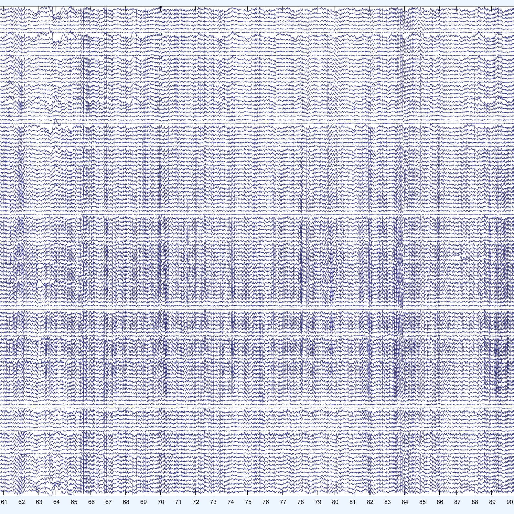
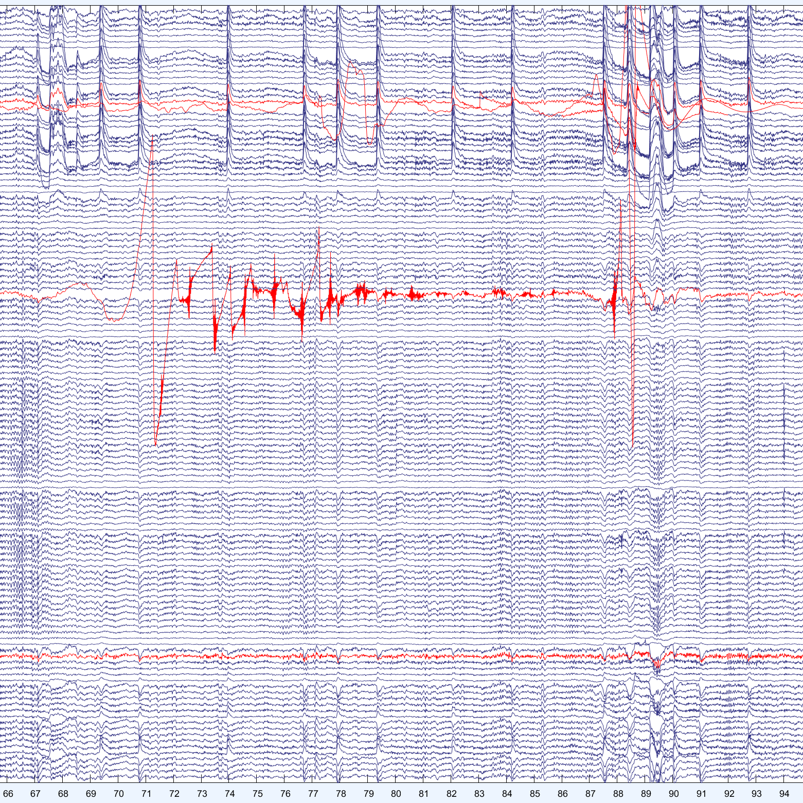

*[<- Go home](./index.html)*
# Suggestions on what data to cut
This is a compilation of what to remove in Prep2, visual inspection.

There are 3 ways to remove data at this stage:
- Cut out a segment in time across all channels
- Remove a whole channel
- Remove a segment in one or few channels for a few seconds (untested)

Since this is an "arbitrary" process, it is important that you don't introduce systematic bias, for example cleaning seperately conditions you later compare, especially if you have reason to believe they might have different levels of noise.
It's also best if you don't know what file you're cleaning each time.

> The goals to keep in mind are, in order:
> 1. Remove anything that would mask data
> 2. Preserve as much data as possible
> 3. Have the data as clean as possible

&nbsp;

### What to remove
The idea is to remove artifacts in the data that don't get filtered out and can't later be removed with ICA. These are most often columns of data where noise completely masks the underlying EEG. Usually there's some channels that have bad impedences, or are located directly over a muscle that are not worth preserving. 

#### Columns of data
- Movement artefacts that cause large amplitude fluctuations in multiple channels
- Bursts of muscle activity that affect many channels at once, limited in time. 
- Anything that affects all channels at once
- Sweating artifacts if they're limited in time

#### Channels
- Channels gone hay-wire, looking completely different from all the others
- Single channels always showing high-frequency noise. (if there are multiple adjacent channels, this can be removed with ICA)
- Channels with subtle but definitely not EEG fluctuations
- Channels that sporadically have artifacts. 

#### Segments
- If there's a one-time artifact in an otherwise clean channel (maybe from participant touching an electrode), or an artefact localized in time affecting few channes (<5), then it might make sense to cut out just that little segment in time.

&nbsp;

### What not to remove
Obviously things that are (or possibly could be) EEG data have to stay. But also to avoid removing too much data, ICA performed later on can extract certain physiological artifacts, so it would be a waste to remove them at this stage.

#### Real data
- Both segments in which not much seems to be happening, clear oscillations, and sometimes exceptional occurances (like sleep slow waves) all need to stay. 

#### Things ICA can remove
- Eye movements (blinks, saccades, slow rolling eye movements), basically anything that occurs repeatedly throughout the recording can be removed with ICA. 
- (sometimes) sweating artifacts, if your data is short enough. 
- (mostly) constant high-frequency noise from muscle tension. This usually occupies a lot of components, but so long as multiple channels contain the same noise, ICA can do a pretty ok job at removing it; mostly there's some real data undernear worth preserving.

#### small things
Cutting out data introduces discontinuities, which also introduce artifacts, especially when calculating power, or ERPs; if the artifact is small, the jump in data will be just as problematic, so there's no real point.

&nbsp;

## Examples

### Clean Data

This data is 60 seconds of EEG across 128 channels, according to the following labels:

&nbsp;

#### Eyes Open

> Bad channels have not been removed yet

&nbsp;

#### Eyes Closed

The circled area shows the artifect of eyes being closed. This will be removed with ICA. The central channels in the pannel are occipital channels, where alpha activity increases once eyes are closed (Berger Effect).

&nbsp;

#### Blinks

This is a participant blinking once per second. All eye movements get nicely removed with ICA. 

#### More clean

&nbsp;

This is actually clean data; instead all the activity comes from a lot of theta oscillations in a strongly sleep deprivated individual. The channels removed had instead high-frequency noise, and occasional flares of poor contact.

&nbsp;

This is all clean, just alpha instead of theta. There are little things, but not worth the effort.
<!-- 

&nbsp;

This is an example of "ugly" data, but no good reason (or method) for getting rid of it. It's ugly because there's a lot of low frequency, low amplitude fluctuations that are not synchronized with neihgboring channels. No idea what causes this. Not too common, though. -->

&nbsp;

Shown here is a microsleep in the middle of wake. Sleep has these global features. Usually something that occurs in all channels is likely noise, but when sleep kicks in, then it's physiological. You can suspect sleep by the eye closing saccade at the beginning, then slow rolling eye movements later on.

&nbsp;

This is real sleep slow waves. If you're seeing these in healthy wake, it's likely noise. But if sleep is even a little possible, don't take these out. 
Sleep often ends with major body movements. 

&nbsp;

Sleep is also characterized by spindles, oscillations in the beta range (15-20Hz). These become pretty indestinguishable from muscle bursts, except the context; you don't get large muscle bursts in sleep, so when you have all the data spread in all the channels like this, you're dealing with sleep, not artefacts.

&nbsp;

These are eye artefacts when participants keep eyes closed. The slow rolling eye movements cause the big waves, and smaller movements cause these little sharp waves in between. All of it gets removed with ICA.

&nbsp;

ICA should still be able to get rid of even this level of eye movement; just double check. Sometimes a whole component is dedicated to extremely large artifacts that are due more to moving electrodes than moving eyes.

&nbsp;

#### Saccades
.PNG)
The boxy activity in top channels are saccades. These are easily removed with ICA. The thick bands of highfrequency noise in the middle are from neck muscle tension, and these can also be removed with ICA.

&nbsp;

### Noise

#### Muscle & movement

The thick dark band affecting almost all channels is muscle activity. This is a very prominent example, but it often occurs in smaller bursts, and in fewer channels. This can either be removed with intense filtering (LP <15Hz), which is suboptimal, or if it's localized in time like this, cut out that segment of data. Likewise if there's a couple of channels that show the same high-frequency activity all the time (because electrode was placed on a muscle), this channel should be removed.

The large sharp spikes in frontal channels (top band) is due to movement of the skin around the eyes shifting under the electrode. This is also what it looks like when the participants scratches the net, or similar. There's no filtering that away, it needs to be cut out. 

&nbsp;

#### Major movement

This is when someone moves a lot of channels at once, for example if they shift the back of their heads against a back-rest. Cut it out.

&nbsp;

#### Bad channels

The channels in red are the ones I choose to remove. The first three are indisputable; the fluctuations are completely out of whack relative to the rest of the EEG. This comes from poor contact of the electrode with the scalp.
The last channel is more subjective. I choose to remove channels with high frequency noise, especially when other channels are much cleaner. If many channels have this muscle activity, it is best to remove it with ICA, so don't bother cutting out many channe;ls

&nbsp;

Here are 2 examples of snippets to remove. The ones on the left are across multiple channels; that's due to a small body movement, so ICA is not good for it, but the rest of the data is really clean so it's a shame to cut it all out; so cut out the segment.

Same story for the spike on the right; it happens only in one channel, the channel is otherwise clean. Worth the effort to cut out just that spike.

&nbsp;

This is not a common type of noise, it was caused (I think) by a particularly static-y sweater the participant was wearing. But it created a lot of spikes, big and small, throughout the data. Some channels had the bulk of it, so I removed those. Other times there would be a big but rare spike for a channel, so I removed just that segment. Many times though, there were lots of little spikes, and I did not have the patience to remove them, so I left them in. Maybe if I get paid more I would remove them.

&nbsp;

The line is what happens when you pause an EEG recording. Technically, it's also what happens whenever you select a column of data to remove, so it would be completely pointless to cut out this piece of data since it wouldn't change anything for the analyses later. 