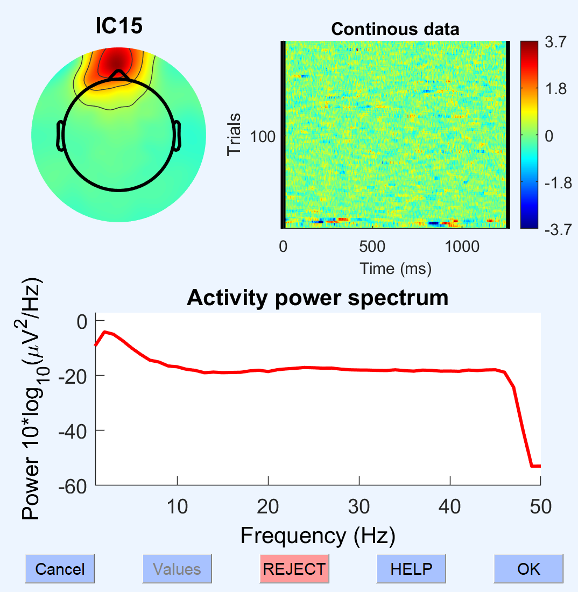
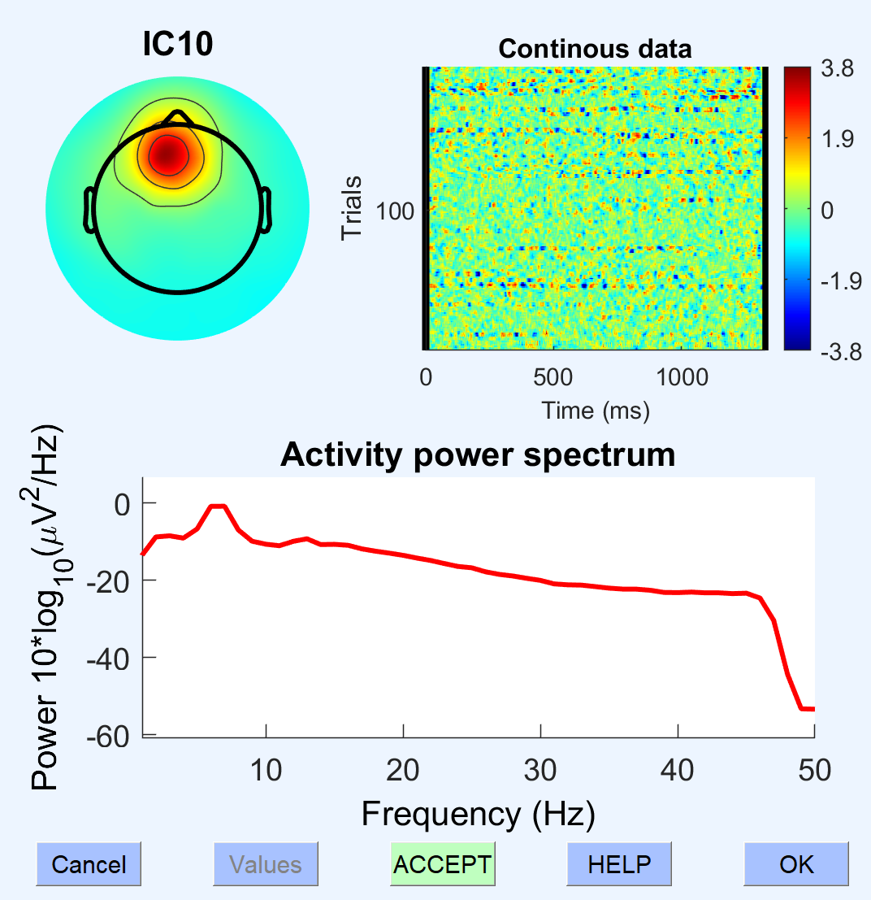
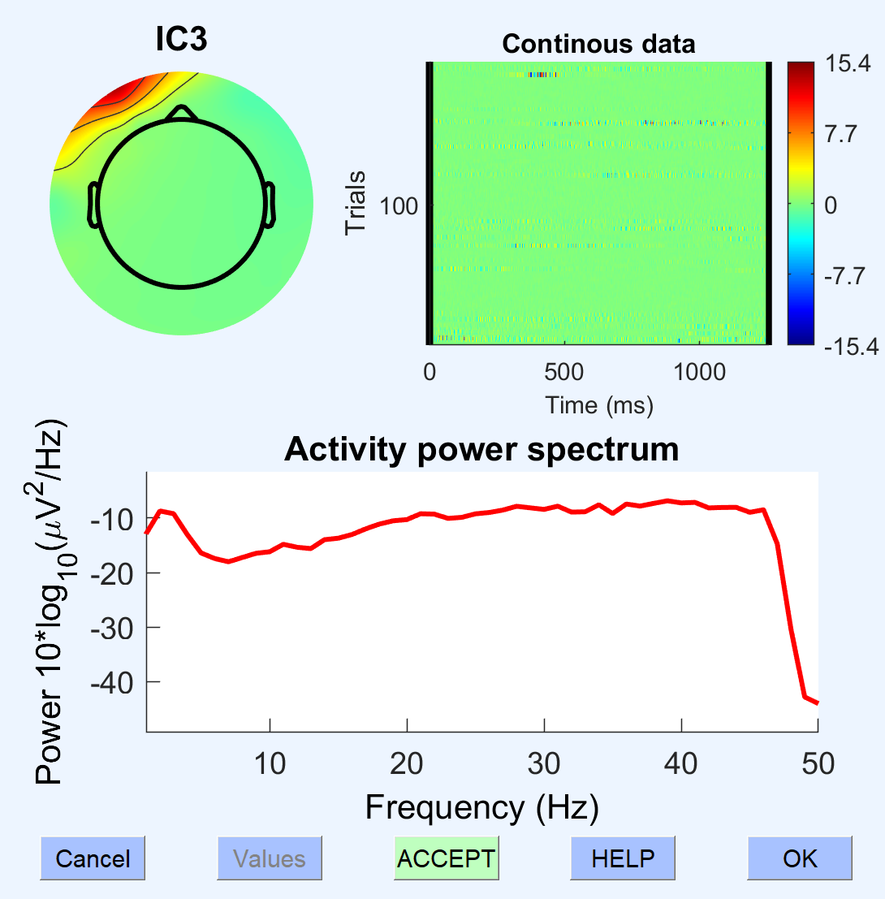

# Components to Remove with ICA

This pipeline finds components to remove by viewing the first 35 components, and the researcher selects the ones that are clearly physiological artifacts. The GUI looks like so:

While the topoplots shown are the first indication if something is an artifact or not, further inspection is required. When you click on the little button on top, a popup like this will appear:

- The topoplot is further enlarged
- the top-right plot indicates the amplitude of the component in time, with the recording represented as thinly stacked bars. If a component only has one or two spikes of activity in the whole recording, it is best not to remove it, and instead cut out this data in Prep2 (you probably already did).
- The bottom plot shows the spectrogram. Brain components are characterized by a gentle slope downwards, and then a sharp cutoff around 50Hz. Alpha or theta components will show prominent bumps in the corresponding ranges.

&nbsp;

### Eye components
#### Blinks

Blinks are easily identifiable by the blobs over the eye channels. Depending on their intensity, the spectrum can either clearly show the 50Hz cutoff or not. In the top-right plot, they appear throughout the recording sporadically, although not at regular frequencies.

Blinks are often among the first components, can be just 1, or even 2-3. 

&nbsp;

Eye components can also be assymetrical, with only one eye really being involved. This is easily the case when the net is on a little crooked (or their eyes are not symmetrical), and so there's an inbalance.

&nbsp;

#### Saccades and other eye movements

I think of this as the Mickey Mouse component. It is common when participants are not fixating properly. I often had it at the beginning and end of a recording, when they were not obbliged to keep their eyes on a cross. 

&nbsp;

These are eye movements, characterized by this blob around channel 17.

&nbsp;

This is a component you have to be really careful with, because it's not obvious why it's not brain data. The main give-away is in the top-right plot, where if the occurances are rapidly alternating blue-red, it means that it's saccades. In case of uncertainty, try removing it, if you see saccades disappear, great; if nothing changes, leave it in.

&nbsp;

These components are tricky. Sometimes, it seems like it's a localized occurance, and should just be left in as a component. Other times, it captures a very large artefact once, and then a lot of smaller activity throughout the recording you want to remove. Again, trial-and-error is best here. 
In general, the fewer artefacts occur, the more shaky the topoplot is for that component.

&nbsp;

### Heartbeat

This is what an ideal hearbeat component can look like.  It has a gradient from one edge to the other of the topoplot, and then in the top-right plot it is characterized by regularly occuring little spikes. The power spectrum is also a little wonky. 

&nbsp;

Unfortunately, sometimes the heartbeat component picks up other stuff, and so you might see something like this. In which case, I would try leaving it in; if heartbeat is still visible when you inspect the data later, then go back and remove it.

&nbsp;

### Muscle

This is a typical eye-muscle component. Unfortunately, ICA is the best way to remove them since they tend to overlap a lot with important channels. Usually, there are multiple such components that need to be removed at the same time. 
In order not to remove too many, my personal benchmark is that I only remove muscle components when the >15Hz spectrum is higher than the <15Hz, and that it is spread out throughout the recording (top-right plot).

&nbsp;

&nbsp;

### DO NOT REMOVE: Data

#### Alpha

This is a typical alpha component. It is definitely EEG data. Not only is it a blob in the middle of the head, but it also has a nice little bump over alpha.

&nbsp;

&nbsp;

It can happen with virtually every component that the polarity gets somehow inverted. When looking at the spectrum though, you see that it's the same thing. When this happens to blinks, it is important that you also remove the inverted components.

&nbsp;

This component is a problem, choose for yourself whether to remove or not; I don't. Basically what happens is if a person has really long blinks, alpha has time to kick in, and so you have alpha oscillations synchronized to the blinks. 

&nbsp;

This is another example of a component that got mixed effects. Don't remove it. 

&nbsp;

Again, mixing noise and data. Leave it in. 

&nbsp;

#### Theta

This was a strong component in one of my participants; it was only identifiable as a strong central blob, with a huge peak in the theta range. This was just how his brain worked...

&nbsp;

This is a standard theta component. Definitely not noise. 

&nbsp;

This one is tricky, but looking at the spectrum, there is a bump in the theta range; so this is likely from the frontal cortex, and not the eyes. 

&nbsp;

This is a clearer example of a component that occurs right over the eyes, but is almost definitely EEG theta oscillations. 

&nbsp;

### Do not remove: messy component

&nbsp;

This is a component driven entirely by one of the two face channels (if not removed before hand). It is characterized by increasingly higher >20Hz activity. When you know something comes from just one channel, don't remove it with ICA, remove it as a channel.

&nbsp;

This is most likely a muscle component, but given that it is not spread throughout the recording, I took out this by cutting data in time instead. Also, the >20Hz activity is lower than the <20Hz.

&nbsp;

If a spectrum looks this weird, leave the component in; it means it's trying to get non-physiological noise into a component, and it's just not good at it. This is data you'll have to cut out in other ways.
N.B. Never remove components that only occupy a single channel; you should remove the channel in Prep2. 

&nbsp;

### Bad things

It can happen that all your components look like this. 

&nbsp;

Or this.  It is because you have such crazy high-amplitude artifacts, that the ICA just doesn't work. It means you have to go to the very beginning, and permanently cut out that data (or set it to 0).

