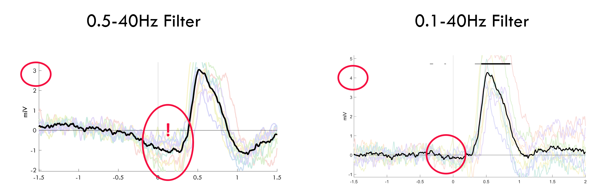
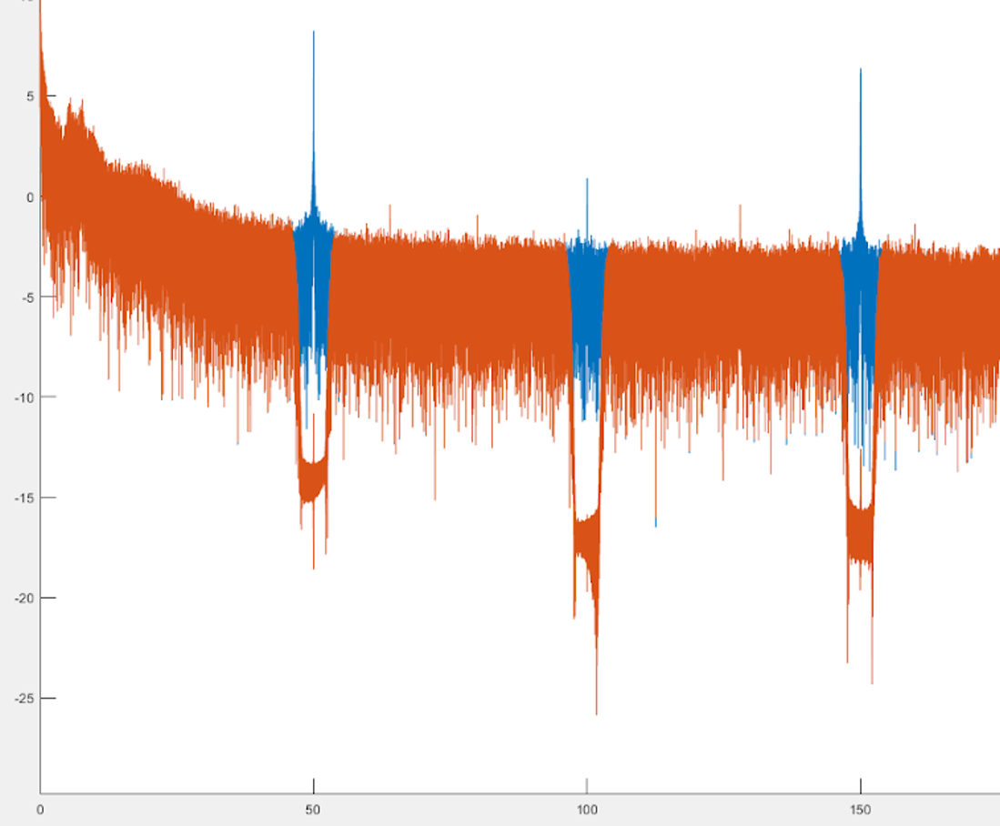

> ### Linked pages
> [version 1](./ICA.html)

This set of MATLAB scripts was developed and used by Sophia Snipes to clean high-density EEG data. This tutorial involves descriptions of the various pieces of code, as well as explanations for certain choices (whether based on prior work, trial-and-error, or just arbitrary), allowing the reader to decide for themselves what they wish to keep or change. There are furthermore detailed descriptions about the manual portions involved in data cleaning, and the criterion used for designating data as noise or artefact. 

Disclaimer: this is a work in progress, and will invariably change as more information comes to light. Exact scripts used in published data are saved in seperate repositories.

# The Pipeline

## 0. Formatting the data
### Dependencies
This process heavily relies on the [EEGLAB Toolbox](https://sccn.ucsd.edu/eeglab/index.php), designed on version 2019.

### Data structure
All files should be saved as ".set", using the EEGLAB data structure. Importantly, these must already contain the fields "srate" and "chanlocs", and of course "data". EEG data is thus stored as a channel x time matrix. An example script is provided for converting data from BrainAmp to EEGLAB.

SET files are expected to be in the same folder, with meaningful names (e.g. "P01_baseline_task1.set"). 

NO PROCESSING should be done to the starting data! It should be the rawest of raw data, saved as an EEGLAB structure. 

### Example script
1. Install BrainAmp extension. This can easily be done from the EEGLAB GUI.
2. Adjust in "General_Parameters.mat" the location of the raw files, and the location in which you want to save the preprocessed data.
3. Run script, and hope for the best!

## 1. Filtering
This script takes the raw data, and filters it in many ways. 

### Filtering parameters

| Type          |  srate     | high-pass | low-pass | stop-band |
| ------------- |:----------:| :-----:   | :-----:  | :-----:   |
| Cleaning      | 125        | 0.5       | 40       | 0.25      |
| ICA           | 500        | 2.5       | 100      | 0.5       |
| Power         | 500        | 0.5       | 40       | 0.25      |
| ERP           | 500        | 0.1       | 40       | .05       |

#### Cleaning
This is used for visually inspecting the data and identfying periods of noise. Uses the minimum reasonable sampling rate to make the files lighter, but has the same pass filters as "Power" and "ERP", because different filters will change whether there's an artefact that needs to be cut out or not. 

#### ICA
ICA can have different filtering parameters than the data you actually remove it from. This is good, since ICA does better in a certain frequency range that is different from what is of interest for the EEG.
The parameters were based off [Person et al. 2020](). The high sampling rate and low-pass filter allows the inclusion of microsaccades in the eye components, so these can also be removed. The high high-pass filter is recommended for removing blinks.

> N.B. Some EEG is plagued by sweating artifacts, and these are <1 Hz. These can be removed with ICA, but with different filters.

#### Power
This is the main data I focus on. The components will be removed from this set. The frequency range is typical for sleep research. The high srate was to match the ICA, but I don't know if that actually matters. 

#### ERP
Different filters are needed for calculating Event Related Potentials, since important components like the P300 can be affected by strong filtering. Furthermore, effects can leak into pre-stimulus timepoints, and that is very bad.

### Procedure
This is the steps that the script follows:

1. **Notch filter for line noise.** Unless the recording was done in a really good Faraday cage, there is usually some line noise. In my own data, there was so much I got harmonics. The function provided does a notch filter for the requested frequency and 4 harmonics using a Kaiser FIR filter. I found it on some stackexchange post, I'm no expert, but the data looked reasonable. 

Usually, this is overkill since most of the time there's the low-pass filter shortly after, but in some recordings, there is just so much line noise, that the LP filter doesn't completely get rid of it. In general, it doesn't hurt.

2. **Low-pass filter.** This is done before resampling as a form of anti-aliasing. Since I don't really care too much about the higher frequencies, much less their phase, I just implemented standard EEGLAB filter for this.

3. 